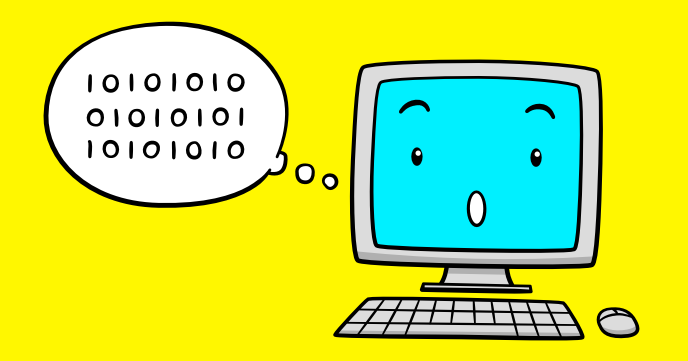

Data sorting is one of the most important operations that your computer is doing. We ask our computer all the time to sort data for us: display all contacts ordered alphabetically, get next movie showtimes (e.g. order by date), etc. Many other computer algorithms are also using sorting internally.

And since we rely so much on data sorting, researchers created many sorting algorithms to do the job in the most efficient way.

In the current program we will investigate of the simplest sorting algorithms also called “Bubble sort”. And will not only learn how to implement it, but also learn how to visualize data in memory at each step during the sorting process.
 
## Source code 
The JavaScript source code of this program can be found [here](sketches/program.js). To run it, you need to import it in the [codeguppy.com](https://codeguppy.com) online editor. Alternatively, you can use the source code in your p5.js sketches (advanced use). 
## Online version 
To see the code running, check the online playground at [https://codeguppy.com/code.html?t=visual_sort](https://codeguppy.com/code.html?t=visual_sort) 
## Next steps 
Please check [codeguppy.com](https://codeguppy.com) for many other fun JavaScript programs and games for beginners. To stay up to date with CodeGuppy development please follow [@codeguppy](https://twitter.com/codeguppy) on Twitter.  
